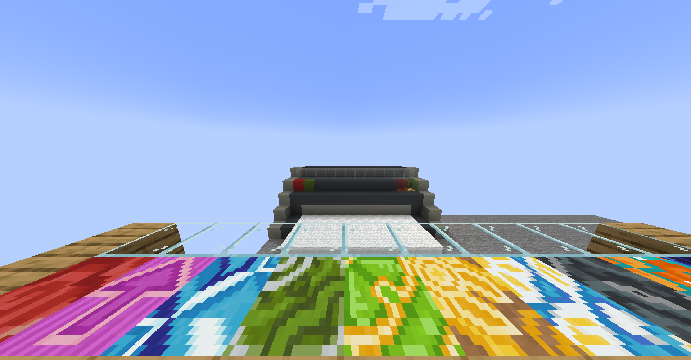
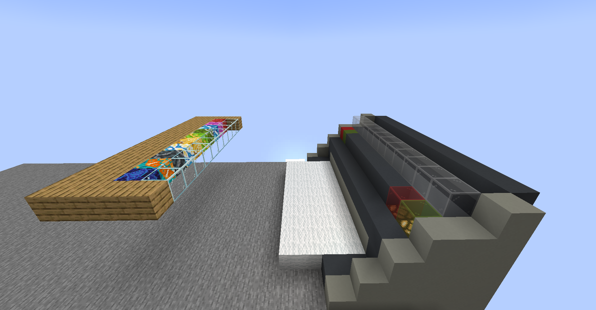
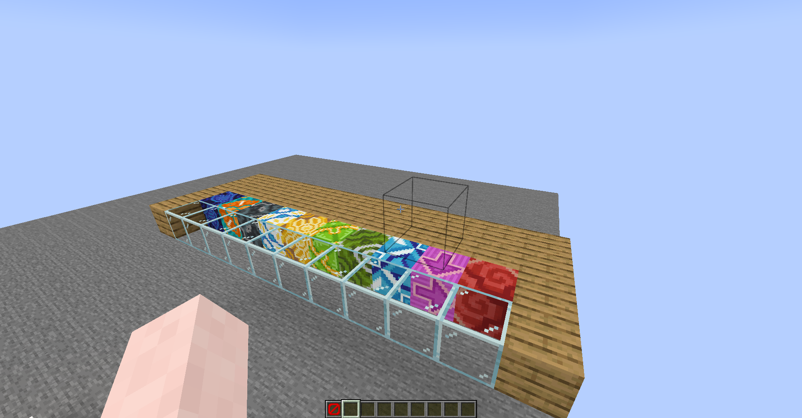
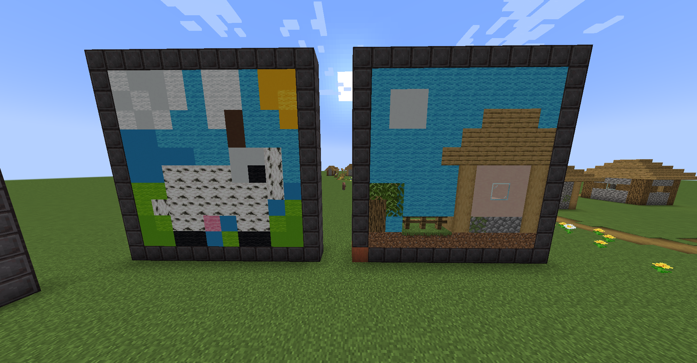
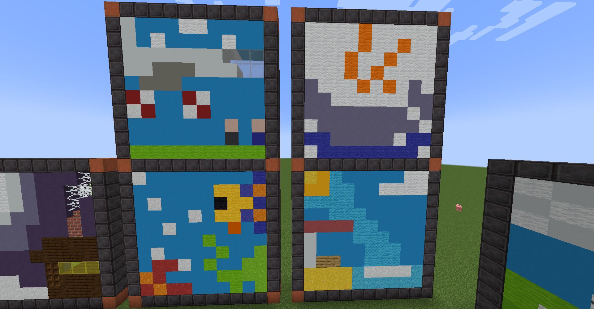
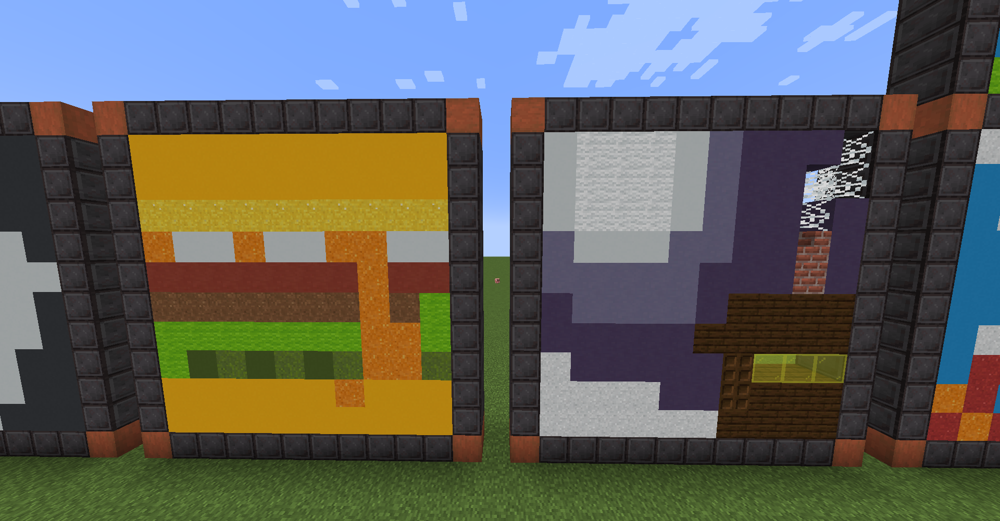
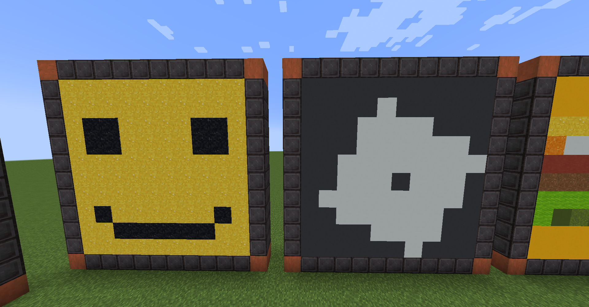
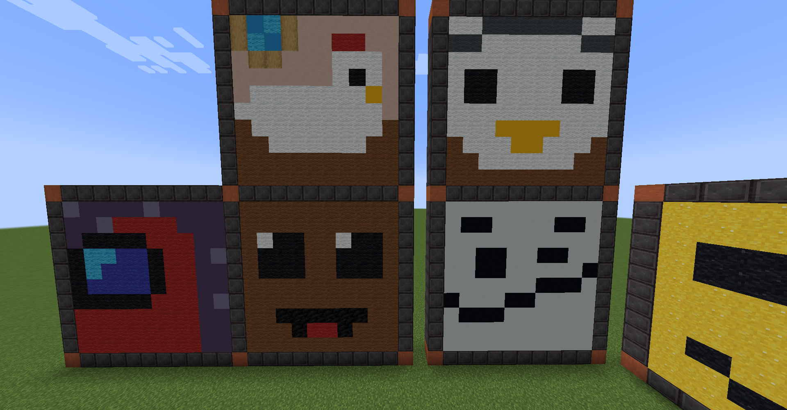

# Printer

This is a mini-game for Hypixel I came up with. (An arcade one, I guess)
<small style="background-color: goldenrod; border-radius: 10px; color: white;">For Spigot 1.20.6</small>

---

Players pick their spot in a 10-block long line which is located in front of a printer. The goal of this game is to correctly print a 10x10 block picture line-by-line. To print a line correctly, all 10 players must hold a correct material in hand while being in front of where it will be printed. For each line, players have some time to arrange on where they are going to stand and what block they'll pick.
Players are also given a reference, of course *(a map)*

---

## Arena

| front(quake-pro shot) | side | rear |
| - | - | - |
|  |  |  |

---

## Pictures

'Cow' & 'Village house' pictures

'250 K of TNT', 'Aquarium', 'Cup', 'Beach'

'Burger' & 'Winter night'

'LEGO® face' & 'Roblox™ logo'

'Red astronaut from "Among Us™"', 'Sackboy™', 'Hen in a coop', 'Penguin in a coat', 'Roblox™ confident face'

Also [check out](images/map%20screenshots/) their map-represented references for in-game use!

---

### [Download worlds](https://drive.google.com/drive/folders/1xa5tRADHr_8GRARBKP4jWXBDAHnidYo5?usp=sharing)
